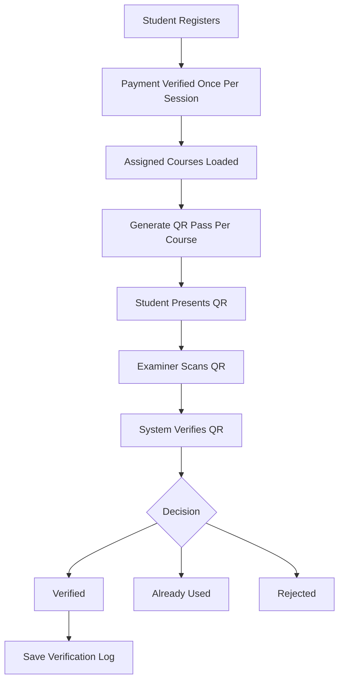
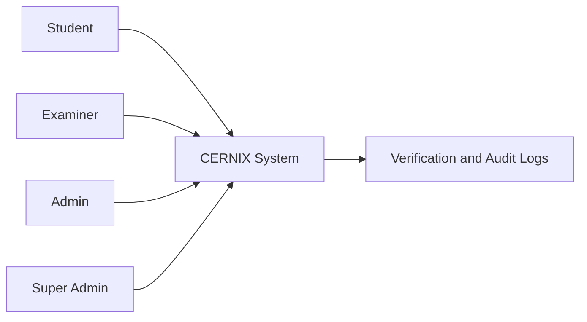
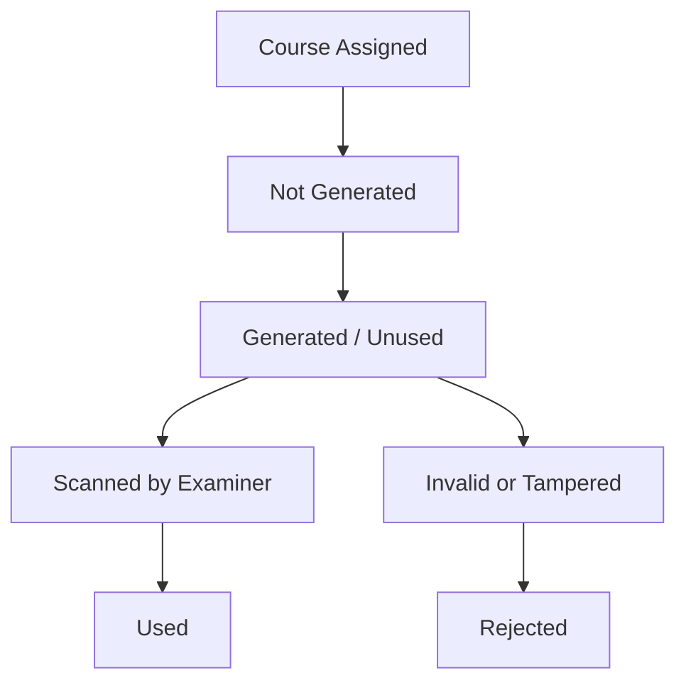

# CERNIX Secure Exam Verification System
## Simple Project Summary and System Flow

**Project Name:** CERNIX Secure Exam Verification System  
**Student Name:** Agwunobi Somtochukwu Bright  
**Matric Number:** 220404008  
**Department:** Computer Science  
**Level:** 400L

---

## 1. Project Overview

CERNIX is a secure exam verification system designed to reduce exam impersonation and unauthorized exam entry.

The system helps a school confirm that the right student is entering the right exam hall for the right course. It does this by using student registration, session payment verification, course timetable assignment, and secure QR exam passes.

CERNIX allows:

- students to register
- students to verify session payment
- students to generate course-specific QR exam passes
- examiners to scan and verify QR passes
- admins to manage students, examiners, timetables, payments, verification records, and settings
- super admins to control higher-level system settings and monitoring

In simple terms, CERNIX replaces manual checking with a more organized digital process.

---

## 2. Main Problem CERNIX Solves

Many schools still rely on manual exam checking. This can cause several problems:

- exam impersonation
- fake exam passes
- students entering exams without payment verification
- lack of reliable verification records
- difficulty managing exam access manually
- poor tracking of scan history and audit logs

CERNIX solves these problems by using:

- secure QR passes
- one-time QR usage
- examiner verification
- clear student identity display
- course and hall assignment
- session-level payment verification
- audit logs and verification records

The main idea is simple: a student should only enter an exam if the system confirms their identity, payment status, course assignment, and QR pass validity.

---

## 3. Main Actors in the System

| Actor | What they do |
|------|--------------|
| Student | Registers, verifies payment, and generates QR passes for assigned courses |
| Examiner | Scans QR passes and verifies student identity |
| Admin | Manages students, examiners, timetable, payments, and verification records |
| Super Admin | Controls higher-level system settings, admin functions, and system monitoring |

Each actor has a different role, which helps keep the system organized and secure.

---

## 4. Full System Flow

The complete CERNIX flow starts from student registration and ends with exam hall verification.

1. Student registers.
2. Student selects department and level.
3. Student dashboard opens.
4. Student verifies payment once for the active session using RRR.
5. System checks session payment.
6. Student sees assigned courses/exams.
7. Student generates QR pass per course.
8. QR pass is tied to student, session, and course/timetable.
9. Student presents QR pass at exam hall.
10. Examiner scans QR.
11. System verifies QR authenticity.
12. Examiner sees student identity and exam details.
13. QR becomes used after successful scan.
14. Verification log is saved.
15. Admin/super admin can review records.

Simple flow diagram:

```text
Student Registration
        ↓
Session Payment Verification
        ↓
Assigned Courses / Timetable
        ↓
Generate Course QR Pass
        ↓
Student Presents QR at Exam Hall
        ↓
Examiner Scans QR
        ↓
System Verifies QR
        ↓
Approved / Already Used / Rejected
        ↓
Verification Log Saved
```

---

## 5. Student Flow

The student flow was designed to be simple and clear.

The student first registers without entering an RRR. During registration, the student selects their department, faculty, and level. After registration, the student dashboard shows registration status, payment status, timetable status, and QR pass status.

The student enters RRR only once for the active exam session. After payment verification, the student can generate QR passes for assigned courses.

Important student flow points:

- registration does not require RRR
- student chooses department/faculty/level
- dashboard shows registration, payment, timetable, and QR status
- RRR is entered once for the active session
- after payment verification, the student can generate QR passes
- QR pass is generated per course/exam
- student cannot generate duplicate QR for the same course
- each course can show:
  - Not Generated
  - Generated / Unused
  - Used

Simple student flow diagram:

```text
Student
  ↓
Register
  ↓
Verify Payment Once Per Session
  ↓
View Assigned Courses
  ↓
Generate QR Pass For Each Course
  ↓
Use QR At Exam Hall
```

---

## 6. Payment / RRR Logic

RRR/payment is session-level, not course-level.

This means the student does not pay separately for every course. School fees or exam payment is handled once for the active session. Once the student payment is verified for that session, the student becomes eligible to generate QR passes for assigned courses.

Meaning:

- school fees/payment is done once for a session
- one verified RRR clears the student for the session
- the student should not enter a new RRR for every course
- courses only determine which QR passes can be generated
- payment does not belong to individual courses

> **Important:** Payment is verified once per session, but QR passes are generated per course.

Simple payment flow:

```text
One RRR Payment
      ↓
Active Exam Session Verified
      ↓
Student Becomes Eligible
      ↓
Course 1 QR Pass
Course 2 QR Pass
Course 3 QR Pass
```

This makes the payment flow easier to understand and closer to how school payment normally works.

---

## 7. QR Pass Logic

The QR pass is course-specific. This means one QR pass belongs to one course or exam.

Each assigned course can have its own QR pass. The QR pass can only be generated once for that course, and it can only be used once during verification.

QR pass rules:

- QR pass is tied to one course/exam
- each course has its own QR pass
- each QR can only be generated once for that course
- each QR can only be used once
- after scan, QR becomes Used
- if scanned again, it should show Already Used, not fake/rejected
- QR contains secure verification data
- scanner verifies the QR before approving entry

QR status table:

| Status | Meaning |
|------|---------|
| Not Generated | Student has not generated QR for that course |
| Generated / Unused | QR exists but has not been scanned |
| Used | QR has already been scanned successfully |
| Rejected | QR is invalid, tampered, expired, or does not match records |
| Already Used | QR was valid before but has already been scanned |

Simple QR status flow:

```text
Course Assigned
      ↓
QR Not Generated
      ↓
Student Generates QR
      ↓
QR Generated / Unused
      ↓
Examiner Scans QR
      ↓
QR Used
```

---

## 8. Examiner Flow

The examiner uses CERNIX to verify students at the exam hall.

The examiner logs in, opens the scanner, and scans the student's QR pass. The system checks the QR code and returns the correct result.

The examiner result screen shows the student identity first because that is the most important information during exam entry.

Student identity section includes:

- student photo
- name
- matric number
- department
- faculty
- level

Exam details are shown after identity:

- course
- hall
- date
- time
- session

Simple examiner flow diagram:

```text
Examiner Login
      ↓
Open Scanner
      ↓
Scan QR Pass
      ↓
System Verifies QR
      ↓
Show Student Identity
      ↓
Show Exam Details
      ↓
Save Verification Record
```

---

## 9. Admin Flow

The admin manages daily exam verification activities.

Admin features include:

- admin dashboard
- student records
- examiner management
- timetable/course assignment
- payment records
- verification records
- scan logs
- student trace
- settings
- notes
- audit/risk monitoring

The admin pages were improved to reduce clutter, align lists better, and make mobile views more readable. The goal was to make the admin interface easier to use without making it too heavy.

---

## 10. Super Admin Flow

The super admin has higher-level control over the system.

Super admin features include:

- access to higher-level control center
- system settings
- admin/examiner oversight
- audit control
- risk intelligence
- verification monitoring
- management of important system configuration

During development, super admin login and baseline access were repaired so that the super admin role could work properly.

---

## 11. Database and Data Flow

CERNIX uses different data areas to keep the system organized.

| Data area | Purpose |
|---------|---------|
| Students | Stores registered student information |
| Departments | Stores departments/faculties |
| Exam Sessions | Stores active academic session and semester |
| Payments | Stores verified RRR/payment records |
| Timetables | Stores assigned courses, halls, dates, and times |
| QR Tokens | Stores QR pass records and usage status |
| Examiners | Stores examiner/admin/super admin accounts |
| Verification Logs | Stores scanner results |
| Audit Logs | Stores important system actions |

Simple data flow:

```text
Student
  ↓
Payment Record
  ↓
Exam Session
  ↓
Timetable / Course
  ↓
QR Token
  ↓
Verification Log
```

This structure helps the system know who the student is, whether payment is verified, what course the student is writing, which QR pass belongs to that course, and what happened during the scan.

---

## 12. Security Summary

CERNIX includes security features to reduce impersonation and fake access.

Security features include:

- role-based login
- student/admin/examiner/super admin separation
- QR token verification
- one-time QR use
- HMAC/signature check
- encrypted payload
- audit logs
- no raw token or HMAC shown in the UI
- rejected QR for tampered/invalid data
- Already Used status for repeated scans

The system is designed so that examiners do not need to understand the technical details. They only need to scan the QR and check the student identity and result shown by the system.

No app secrets, keys, or raw secure payloads should be exposed to users.

---

## 13. UI and Design Improvements Made

Several UI improvements were made during the project.

Major design improvements include:

- cleaner student dashboard
- improved Generate QR Pass page
- removed redundant generic Exam Pass flow
- QR pass now accessed through course selection
- QR pass redesigned for mobile
- student profile image made circular
- QR container made square
- AAUA logo added as visible but subtle background watermark
- examiner scan result identity layout improved
- admin and super admin listings improved
- reduced heavy card usage
- muted colors
- removed excessive icons
- improved spacing and alignment
- mobile-first improvements

The design goal was to keep the interface minimal, readable, and useful without making it look too heavy.

---

## 14. Major Fixes and Improvements Made

The following features and fixes were implemented or improved during development:

- registration flow repaired
- department selection fixed
- admin/examiner/super admin login repaired
- baseline accounts repaired safely
- Render deployment and persistence issues worked on
- payment/RRR moved away from registration
- RRR made session-level
- QR pass made course-specific
- one QR per course logic added
- Used/Unused/Not Generated statuses added
- duplicate QR generation blocked
- QR scanner rejection logic investigated/fixed
- Already Used separated from Rejected
- student detail SQL error around `qr_tokens.timetable_id` addressed
- admin and examiner student detail views improved
- QR pass mobile layout redesigned several times
- examiner scan identity layout improved
- admin/super admin list alignment improved
- UI simplified and made more minimalist

These improvements helped move the project from a basic exam verification idea into a more complete student, examiner, admin, and super admin system.

---

## 15. Current Final Flow Summary

```text
Student registers
Student verifies payment once for session
Student sees assigned courses
Student generates QR pass per course
Examiner scans QR
System verifies QR
Student identity and exam details are shown
QR becomes used
Admin/super admin can review records
```

This is better than manual exam checking because it reduces guesswork. Instead of relying only on printed slips or verbal confirmation, the examiner can scan a QR pass and immediately see the student identity and exam details.

It also improves record keeping. Each scan creates a verification record, making it easier for the school to review what happened later.

It also improves control. Students must be registered, payment must be verified for the session, and QR passes are tied to assigned courses. This makes unauthorized entry harder.

---

## 16. Mermaid Diagrams

### Diagram 1: Overall Flow



### Diagram 2: Actors



### Diagram 3: QR Status



---

## 17. Conclusion

CERNIX is a secure exam verification system that improves how students are cleared for exams. It brings student registration, payment verification, timetable assignment, QR pass generation, examiner scanning, and admin monitoring into one system.

The project focuses on reducing impersonation, preventing fake exam access, improving exam hall verification, and keeping proper records of every scan.

In its final flow, payment is verified once per session, QR passes are generated per course, examiners scan QR passes at the hall, and admins can review the records. This makes exam verification more organized, traceable, and secure.
