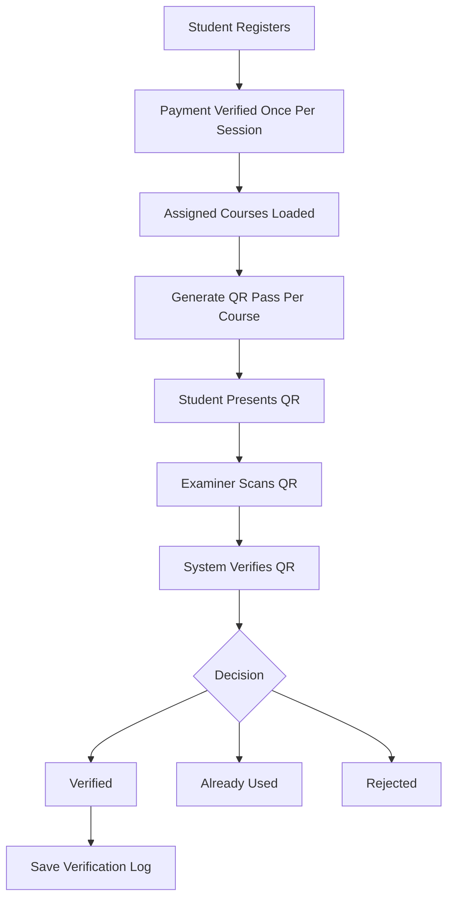
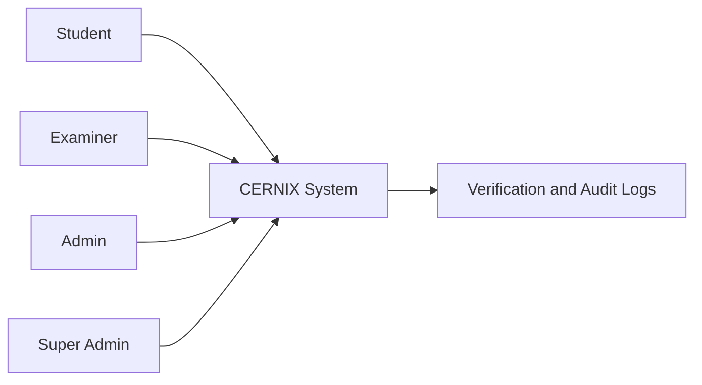
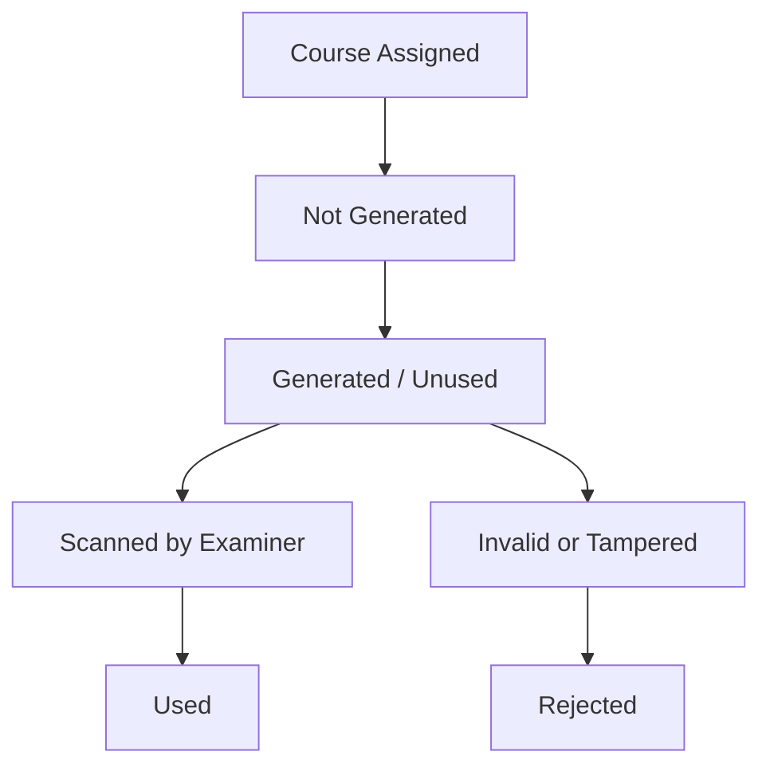

# CERNIX Secure Exam Verification System
## Simple Project Summary and System Flow

**Project Name:** CERNIX Secure Exam Verification System  
**Student Name:** Agwunobi Somtochukwu Bright  
**Matric Number:** 220404008  
**Department:** Computer Science  
**Level:** 400L  

---

## 1. Project Overview

CERNIX is a secure exam verification system designed to reduce exam impersonation and unauthorized entry into examination halls.

Instead of relying only on manual checking, CERNIX uses student registration, payment verification, course-specific QR exam passes, and examiner scanning to confirm whether a student is allowed to enter a particular exam.

The system allows:

- students to register
- students to verify session payment
- students to generate course-specific QR exam passes
- examiners to scan and verify QR passes
- admins to manage students, examiners, timetables, payments, verification records, and settings
- super admins to control higher-level system settings and monitoring

In simple terms, CERNIX helps confirm three major things before a student enters an exam hall:

1. the student is registered
2. the student has verified payment for the session
3. the QR pass is genuine and belongs to the correct student and course

---

## 2. Main Problem CERNIX Solves

Many institutions still depend heavily on manual checking during examinations. This can create several problems.

### Problems

- exam impersonation
- fake exam passes
- students entering exams without payment verification
- lack of reliable verification records
- difficulty managing exam access manually
- poor tracking of scan history and audit logs

### How CERNIX solves these problems

CERNIX solves these problems by using:

- secure QR pass generation
- one-time QR usage
- examiner verification
- clear student identity display
- course and hall assignment
- session-level payment verification
- audit logs and verification records

The goal is to make exam entry more secure, organized, and traceable.

---

## 3. Main Actors in the System

| Actor | What they do |
|------|--------------|
| Student | Registers, verifies payment, generates QR passes for assigned courses |
| Examiner | Scans QR passes and verifies student identity |
| Admin | Manages students, examiners, timetable, payments, and verification records |
| Super Admin | Controls higher-level system settings, admin functions, and system monitoring |

Each actor has a different role, and the system separates their access so that users only see the parts meant for them.

---

## 4. Full System Flow

The system starts from student registration and ends with examiner verification at the exam hall.

### Step-by-step flow

1. Student registers
2. Student selects department and level
3. Student dashboard opens
4. Student verifies payment once for the active session using RRR
5. System checks session payment
6. Student sees assigned courses/exams
7. Student generates QR pass per course
8. QR pass is tied to student, session, and course/timetable
9. Student presents QR pass at exam hall
10. Examiner scans QR
11. System verifies QR authenticity
12. Examiner sees student identity and exam details
13. QR becomes used after successful scan
14. Verification log is saved
15. Admin/super admin can review records

### Simple flow diagram

```text
Student Registration
        ↓
Session Payment Verification
        ↓
Assigned Courses / Timetable
        ↓
Generate Course QR Pass
        ↓
Student Presents QR at Exam Hall
        ↓
Examiner Scans QR
        ↓
System Verifies QR
        ↓
Approved / Already Used / Rejected
        ↓
Verification Log Saved
```

---

## 5. Student Flow

The student flow was improved to make the process clearer and more realistic.

A student does not need to enter RRR during registration. Registration comes first, then payment verification happens later from the student dashboard.

### Student flow details

- registration does not require RRR
- student chooses department/faculty/level
- dashboard shows registration, payment, timetable, and QR status
- RRR is entered once for the active session
- after payment verification, the student can generate QR passes
- QR pass is generated per course/exam
- student cannot generate duplicate QR for the same course
- each course can show:
  - Not Generated
  - Generated / Unused
  - Used

### Student flow diagram

```text
Student
  ↓
Register
  ↓
Verify Payment Once Per Session
  ↓
View Assigned Courses
  ↓
Generate QR Pass For Each Course
  ↓
Use QR At Exam Hall
```

---

## 6. Payment / RRR Logic

RRR/payment is session-level, not course-level.

This means the student does not need to enter a different RRR for every course. One verified payment clears the student for the active exam session.

### Meaning

- school fees/payment is done once for a session
- one verified RRR clears the student for the session
- the student should not enter a new RRR for every course
- courses only determine which QR passes can be generated
- payment does not belong to individual courses

> **Important:** Payment is verified once per session, but QR passes are generated per course.

### Payment flow diagram

```text
One RRR Payment
      ↓
Active Exam Session Verified
      ↓
Student Becomes Eligible
      ↓
Course 1 QR Pass
Course 2 QR Pass
Course 3 QR Pass
```

---

## 7. QR Pass Logic

The QR pass is one of the most important parts of CERNIX. It is used to verify that the student is eligible for a particular exam.

### How the QR pass works

- QR pass is tied to one course/exam
- each course has its own QR pass
- each QR can only be generated once for that course
- each QR can only be used once
- after scan, QR becomes Used
- if scanned again, it should show Already Used, not fake/rejected
- QR contains secure verification data
- scanner verifies the QR before approving entry

### QR statuses

| Status | Meaning |
|------|---------|
| Not Generated | Student has not generated QR for that course |
| Generated / Unused | QR exists but has not been scanned |
| Used | QR has already been scanned successfully |
| Rejected | QR is invalid, tampered, expired, or does not match records |
| Already Used | QR was valid before but has already been scanned |

### QR flow diagram

```text
Course Assigned
      ↓
QR Not Generated
      ↓
Student Generates QR
      ↓
QR Generated / Unused
      ↓
Examiner Scans QR
      ↓
QR Used
```

---

## 8. Examiner Flow

The examiner uses the scanner to verify students at the exam hall.

The examiner scan result should make the student identity easy to see first, because the main job of the examiner is to confirm that the student standing in front of them matches the student information on the screen.

### Examiner flow details

- examiner logs in
- examiner opens scanner
- examiner scans student QR
- system checks QR
- examiner sees result
- student identity is shown clearly first
- identity section includes:
  - student photo
  - name
  - matric number
  - department
  - faculty
  - level
- exam details are shown after identity:
  - course
  - hall
  - date
  - time
  - session
- system records scan result

### Examiner flow diagram

```text
Examiner Login
      ↓
Open Scanner
      ↓
Scan QR Pass
      ↓
System Verifies QR
      ↓
Show Student Identity
      ↓
Show Exam Details
      ↓
Save Verification Record
```

---

## 9. Admin Flow

The admin manages the operational side of the system.

### Admin features

- admin dashboard
- student records
- examiner management
- timetable/course assignment
- payment records
- verification records
- scan logs
- student trace
- settings
- notes
- audit/risk monitoring

Admin pages were improved to reduce clutter, align lists better, and make mobile views more readable. The aim was to make the admin area cleaner and easier to use without making it look too complicated.

---

## 10. Super Admin Flow

The super admin controls higher-level system functions.

### Super admin features

- access to higher-level control center
- system settings
- admin/examiner oversight
- audit control
- risk intelligence
- verification monitoring
- management of important system configuration

During development, super admin login and baseline access were repaired so that higher-level system access could work more reliably.

---

## 11. Database and Data Flow

CERNIX stores records for students, payments, QR passes, timetables, examiners, verification logs, and audit activities.

### Main data areas

| Data area | Purpose |
|---------|---------|
| Students | Stores registered student information |
| Departments | Stores departments/faculties |
| Exam Sessions | Stores active academic session and semester |
| Payments | Stores verified RRR/payment records |
| Timetables | Stores assigned courses, halls, dates, and times |
| QR Tokens | Stores QR pass records and usage status |
| Examiners | Stores examiner/admin/super admin accounts |
| Verification Logs | Stores scanner results |
| Audit Logs | Stores important system actions |

### Data flow diagram

```text
Student
  ↓
Payment Record
  ↓
Exam Session
  ↓
Timetable / Course
  ↓
QR Token
  ↓
Verification Log
```

---

## 12. Security Summary

CERNIX includes several security features to protect exam verification.

### Security features

- role-based login
- student/admin/examiner/super admin separation
- QR token verification
- one-time QR use
- HMAC/signature check
- encrypted payload
- audit logs
- no raw token or HMAC shown in UI
- rejected QR for tampered/invalid data
- Already Used status for repeated scans

In simple terms, the system does not just read any QR code and approve it. It checks whether the QR is genuine, whether it belongs to the right student and exam, and whether it has already been used.

Sensitive data such as secret keys, raw encrypted payloads, and HMAC values should not be displayed to users.

---

## 13. UI and Design Improvements Made

Several design improvements were made to make CERNIX easier to use and more professional.

### UI improvements

- cleaner student dashboard
- improved Generate QR Pass page
- removed redundant generic Exam Pass flow
- QR pass now accessed through course selection
- QR pass redesigned for mobile
- student profile image made circular
- QR container made square
- AAUA logo added as visible but subtle background watermark
- examiner scan result identity layout improved
- admin and super admin listings improved
- reduced heavy card usage
- muted colors
- removed excessive icons
- improved spacing and alignment
- mobile-first improvements

The general design direction became simpler, cleaner, and more focused on the most important information.

---

## 14. Major Fixes and Improvements Made

The project went through several changes, implementations, and improvements during development.

### Implemented or improved

- registration flow repaired
- department selection fixed
- admin/examiner/super admin login repaired
- baseline accounts repaired safely
- Render deployment and persistence issues worked on
- payment/RRR moved away from registration
- RRR made session-level
- QR pass made course-specific
- one QR per course logic added
- Used/Unused/Not Generated statuses added
- duplicate QR generation blocked
- QR scanner rejection logic investigated/fixed
- Already Used separated from Rejected
- student detail SQL error around `qr_tokens.timetable_id` addressed
- admin and examiner student detail views improved
- QR pass mobile layout redesigned several times
- examiner scan identity layout improved
- admin/super admin list alignment improved
- UI simplified and made more minimalist

These improvements made the system closer to a real exam verification workflow.

---

## 15. Current Final Flow Summary

```text
Student registers
Student verifies payment once for session
Student sees assigned courses
Student generates QR pass per course
Examiner scans QR
System verifies QR
Student identity and exam details are shown
QR becomes used
Admin/super admin can review records
```

CERNIX is better than manual exam checking because it reduces the chances of fake exam passes and impersonation. Instead of relying only on paper or verbal confirmation, the examiner can scan a QR pass and immediately see the student's identity and exam details.

It also improves record keeping. Every verification attempt can be saved, which makes it easier for admins and super admins to review who was checked, when the scan happened, and what decision was returned by the system.

The system is also more organized because payment, timetable, student identity, QR pass generation, and verification all work together. This makes exam access easier to manage than checking each student manually without a reliable digital trail.

---

## 16. Mermaid Diagrams

### Diagram 1: Overall Flow



### Diagram 2: Actors



### Diagram 3: QR Status



---

## 17. Short Feature Summary

### Student side

Students can register, verify session payment, view assigned courses, and generate QR exam passes for each course.

### Examiner side

Examiners can scan student QR passes, verify exam eligibility, view student identity clearly, and record scan decisions.

### Admin side

Admins can manage students, examiners, payments, timetables, scan records, and system monitoring areas.

### Super admin side

Super admins can oversee higher-level settings, control center features, risk/audit areas, and system-wide monitoring.

---

## 18. Simple Conclusion

CERNIX is a secure exam verification system that improves the way students are checked before entering an exam hall. It combines registration, payment verification, course-specific QR passes, examiner scanning, and admin monitoring into one system.

The project was improved step by step to make the flow more realistic, especially by separating registration from payment, making RRR session-level, making QR passes course-specific, and improving the design of student identity display.

Overall, CERNIX provides a clearer, safer, and more reliable way to manage exam entry than a fully manual process.
