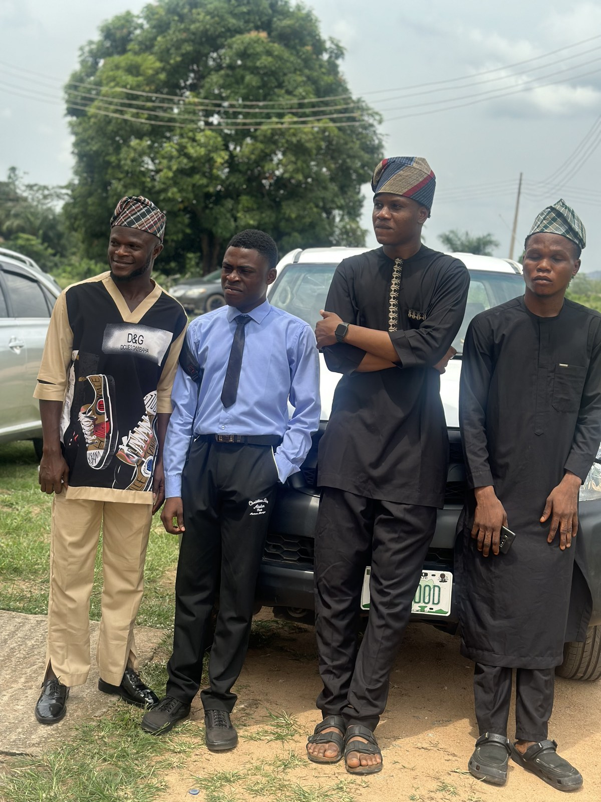
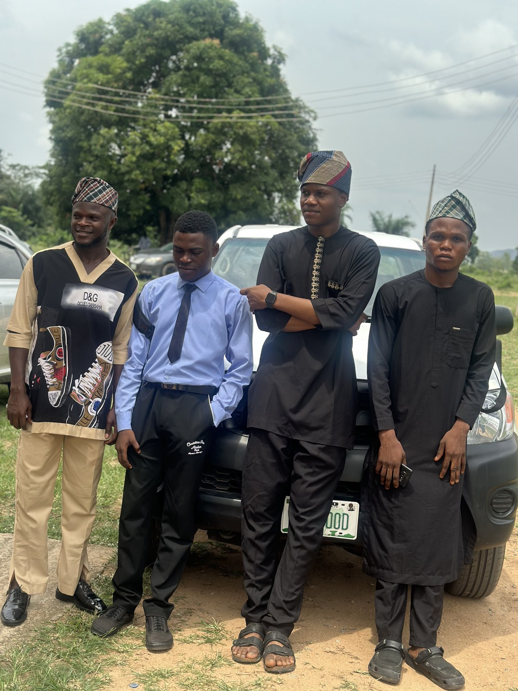

# CERNIX Project Media

Me and my coursemates at AGRIC LT after our project proposal defense.

This image is included as project documentation/context media showing the team after the CERNIX project proposal defense. It is not used as student identity/passport media.

They are documentation media only. They are not mock student passport photos, not official identity images, and are not assigned to any student record, Exam Access ID, examiner verification result, or admin identity view.

## Images

## Files

- `docs/images/project-media/project-context-01.jpg`
- `docs/images/project-media/project-context-02.jpg`
- `public/docs/project-media/project-context-01.jpg`
- `public/docs/project-media/project-context-02.jpg`
- Original supplied HEIC files remain in `public/docs/project-media/` for archive/reference.

If these images are displayed in the app, they should appear only in a documentation/about/demo context. Do not crop them into passport photos or use them as student identity images.
